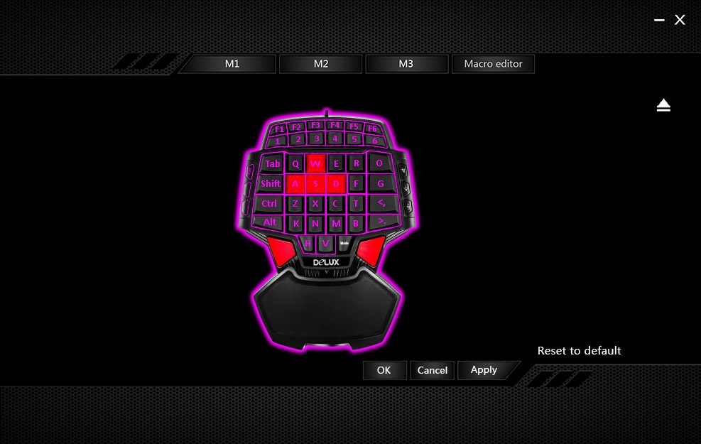
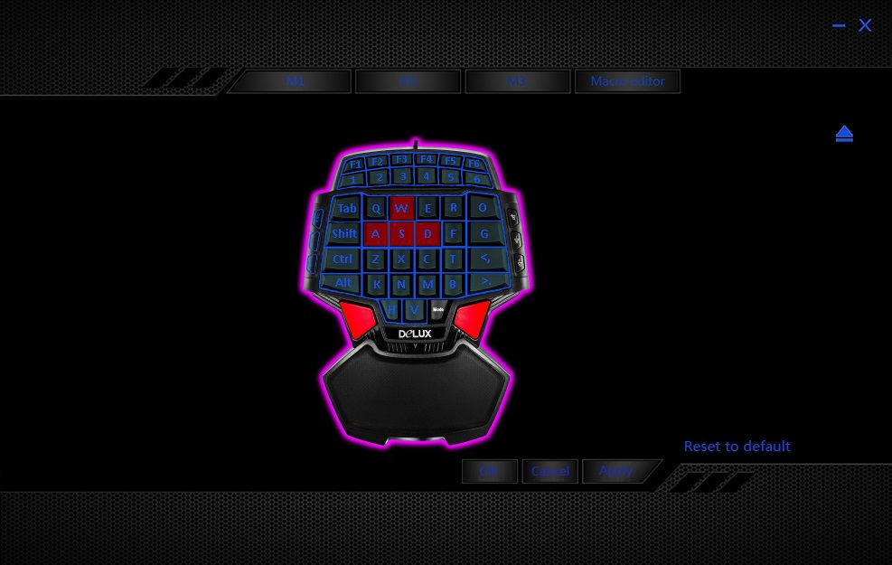

## What is it?
Skin for kb_custom driver for remapping keys for chinese replica (no led) of Delux T9U gaming keyboard.

<table>
    <tr>
        <td>
            
        </td>
        <td>
            
        </td>
    </tr>
</table>

## How to install
* Download and install driver for [Delux T9Pro](http://www.deluxworld.com/en/product/djzb/dsjp/49.html) keyboard. Check if it changes tray icon color when Delux keyboard is connected to USB.
* Click right mouse button on tray icon and choose Exit.
* Replace files in "c:\Program Files (x86)\KbCustom Driver\Skins\" folder (by default) by this repo files.
* Start KbCustom.exe. It must show T9U keyboard skin.

## What it can do
Remap keys on your T9 keyboard with T9U skin.

## What it cant do
Driver cant remap Volume+, Volume-, Mute, Space, Mode keys.
